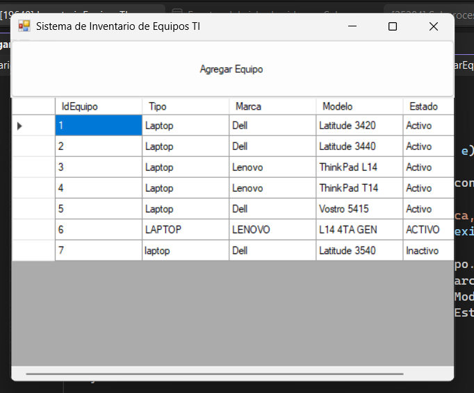
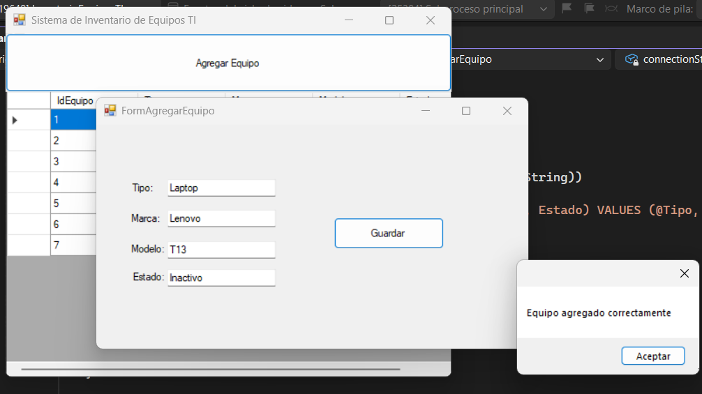
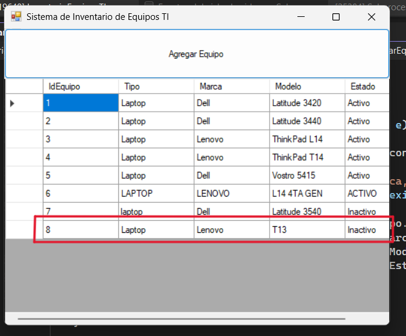

# Sistema de Inventario de Equipos TI

**Materia:** Algoritmos y Estructura de Datos
**Profesora:** Ing. Paula Daniela Muñoz Zárate
**Fecha:** 25 de abril del 2026

## Descripción
Este proyecto consiste en el desarrollo de un **Sistema de Inventario de Equipos de Tecnologías de la Información**, el cual permite administrar y visualizar los equipos registrados en una base de datos.

El sistema fue desarrollado en **C# con Windows Forms**, utilizando una **base de datos en SQL Server**, haciendo uso de **estructuras de datos** para el manejo de la información y un entorno gráfico amigable para el usuario.

Permite consultar el inventario existente y agregar nuevos equipos de manera sencilla.

---

## Tecnologías Utilizadas
- C# (.NET Framework – Windows Forms)
- SQL Server
- Visual Studio 2022
- GitHub

---

## Funcionalidades
- Visualización del inventario de equipos
- Conexión a base de datos SQL Server
- Agregar nuevos equipos mediante formularios
- Persistencia de datos
- Uso de estructuras de datos (`List<T>`)

---

## Instalación y Configuración

   -Clonar el repositorio:
   
     ```
     bash
     git clone https://github.com/brenzuni9-sys/InventarioEquiposTI.git
     ```

1. Abrir el archivo .sln desde la carpeta /src con Visual Studio 2022.

2. Ejecutar el script de base de datos ubicado en la carpeta /db:

        InventarioTI.sql

3. Verificar la cadena de conexión en el archivo del formulario principal:
```
   Server=.\SQLEXPRESS;
   Database=InventarioTI;
   Trusted_Connection=True;
```

4. Ejecutar el proyecto.

---

## Demostración del Sistema

  ### Formulario Principal - Inventario



  ### Formulario Agregar Equipo




---

## Estructuras de Datos Utilizadas

Lista genérica List<Equipo> para almacenar y manejar los registros obtenidos desde la base de datos.

---

## Integrante

Nombre del Alumno: Brenda Jaqueline Zúñiga Medina

Número de cuenta: 333007889

---

## Conclusiones

El desarrollo de este sistema permitió aplicar conceptos fundamentales de estructuras de datos, programación orientada a objetos y conexión a bases de datos, integrando una solución funcional y organizada que simula un entorno real de inventario de TI.
